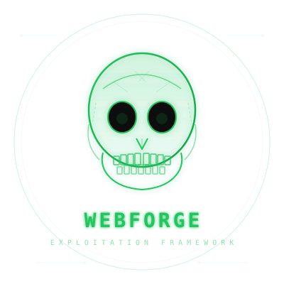

# WebForge

<p align="center">
  
</p>

<p align="center">
  <b>Web Exploitation Framework — The Metasploit of Web Application Security</b><br/>
  A unified security assessment platform with CLI, API, and WebUI for web application
  penetration testing, vulnerability scanning, exploitation, and reporting.
</p>

<p align="center">
  
  
  
  
</p>

---

## Features

| Category | Capabilities |
|---|---|
| **Vulnerability Scanning** | Automated scans, port scans, form crawling, secret scanning, fuzzing |
| **Exploitation** | CMS exploits, CVE exploitation, social engineering |
| **Credential Attacks** | Brute force, password spray, credential stuffing, account enumeration |
| **Session Management** | C2 sessions, shell/meterpreter, file transfer, hash dumps |
| **CVE Intelligence** | CVE database, Sploitus integration, exploit search |
| **OSINT** | Identity investigation, breach checking |
| **Face Intelligence** | Face detection, embedding, and reverse face search against an authorized local index (privacy-safe, in-memory only) |
| **AI Integration** | LLM-powered analysis, chat, exploit assistance |
| **Bug Bounty** | Workspace management, recon, reporting |
| **Payloads** | Generation, encoding, fingerprinting |
| **OWASP Top 10** | Technique reference and mapping |
| **Google Dorking** | Dork library and execution |

> **Phishing** — templates, tunnels, and rendering are also included for authorized security engagements.

## Architecture

```
CLI (Python REPL)   ─┐
API (FastAPI)       ─┼──►  Shared Services  ──►  Core  ──►  Engine  ──►  Modules
WebUI (React/TS)    ─┘
```

All interfaces share the same service layer and business logic — no duplicated core code between the CLI and WebUI.

## Installation

**Requirements:** Python 3.11+, Node.js 18+

```bash
# Backend
python3 -m venv venv
source venv/bin/activate
pip install -e ".[web,dev]"

# Frontend
cd webui && npm install
```

## Quick Start

**CLI**
```bash
webforg                 # Interactive REPL
```

**WebUI**
```bash
webforg web --auth      # Start WebUI with authentication
# Open https://127.0.0.1:8443
```

**Update the CVE database**
```bash
webforg update
```

## Testing

```bash
venv/bin/python -m pytest tests -q            # 570+ tests
venv/bin/python -m compileall webforg tests   # compile check
cd webui && npx tsc --noEmit                  # TypeScript check
cd webui && npx vite build                    # production build
```

## Configuration

All settings are configured through environment variables:

| Variable | Default | Description |
|---|---|---|
| `WEBFORGE_AUTH` | `0` | Enable authentication |
| `WEBFORGE_PASSWORD` | auto | Admin password |
| `WEBFORGE_HOST` | `0.0.0.0` | Bind host |
| `WEBFORGE_PORT` | `8443` | Bind port |
| `WEBFORGE_DEBUG` | `0` | Debug mode |

## Screenshots

<div align="center">
  
  
  
  
  
  
  
  
  
</div>

## Security

This is a **penetration testing framework**. It deliberately includes offensive capabilities
such as scanning, exploitation, and C2 tooling.

> **Use only on systems you have explicit authorization to test.**

## License

This project is licensed for authorized security testing and research use only.
Redistribution or use for unauthorized purposes is prohibited.
