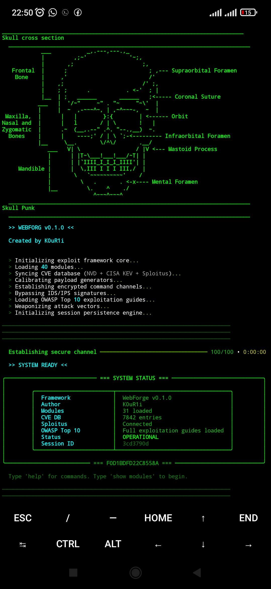
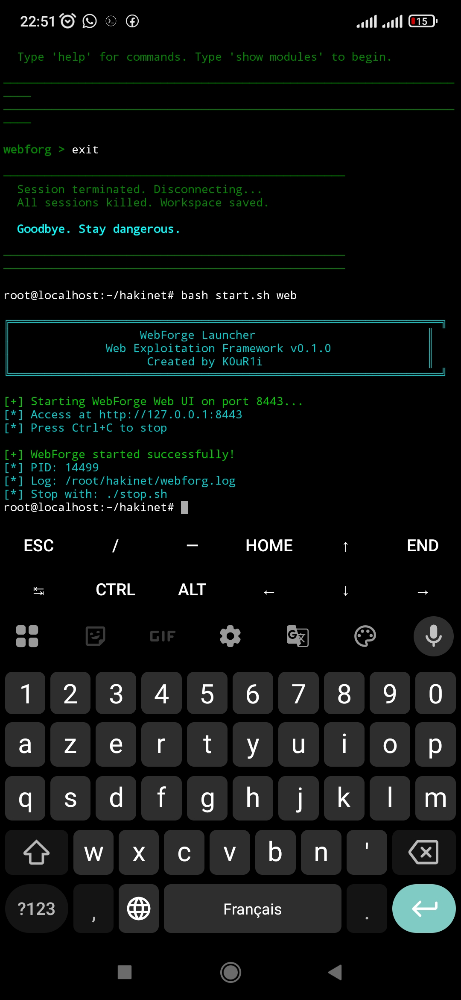
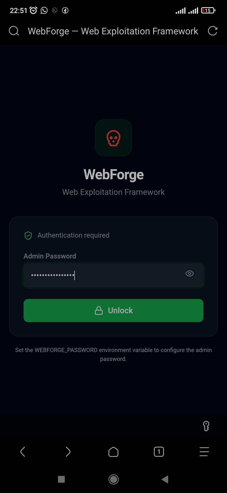
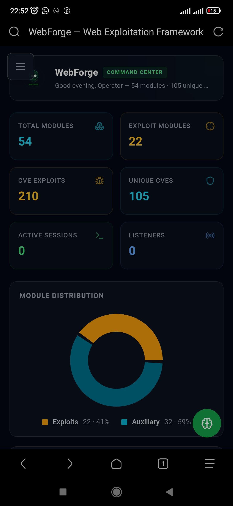
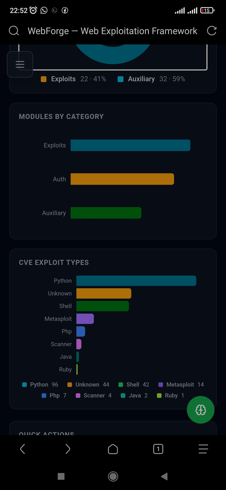
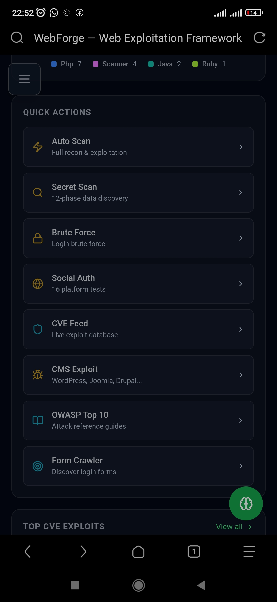
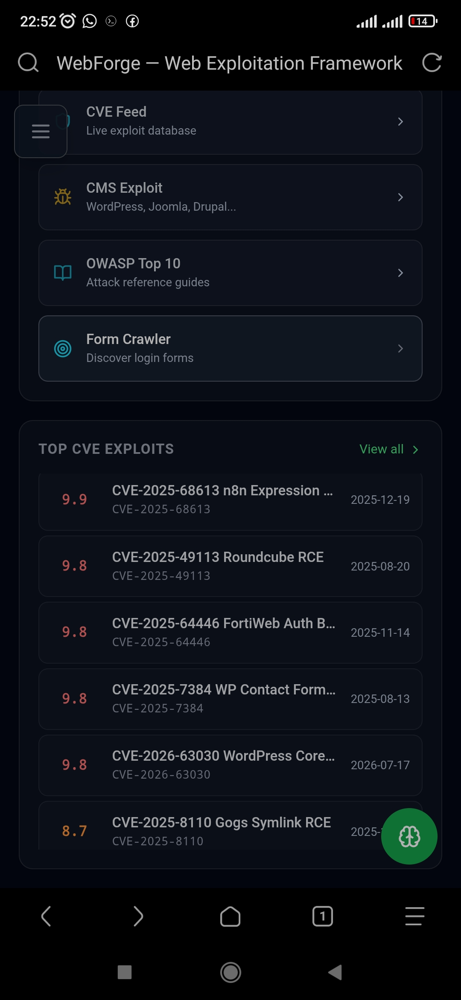
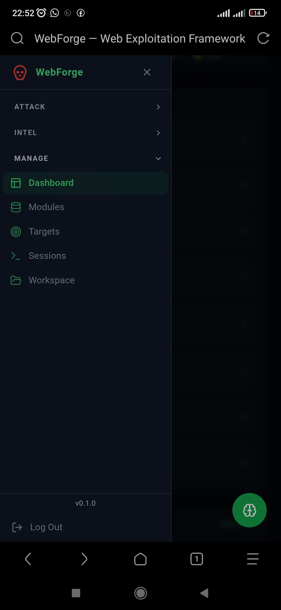
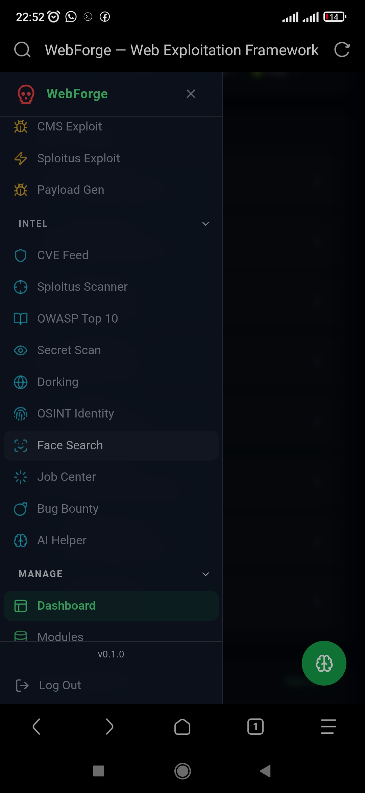

# WebForge

**Web Exploitation Framework — The Metasploit of Web Application Security**

A comprehensive security assessment platform with CLI, API, and WebUI interfaces for web application penetration testing, vulnerability scanning, exploitation, and reporting.

## Capabilities

- **Vulnerability Scanning** — automated scan, port scan, form crawling, secret scanning, fuzzing
- **Exploitation** — CMS exploits, CVE exploitation, social engineering
- **Credential Attacks** — brute force, password spray, credential stuffing, account enumeration
- **Session Management** — C2 sessions, shell/meterpreter, file transfer, hash dumps
- **CVE Intelligence** — CVE database, Sploitus integration, exploit search
- **OSINT** — identity investigation, breach checking
- **Face Intelligence** — face detection, embedding, and reverse face search against an authorized local index (privacy-safe, in-memory only)
- **AI Integration** — LLM-powered analysis, chat, exploit assistance
- **Bug Bounty** — workspace management, recon, reporting
- **Payloads** — generation, encoding, fingerprinting
- **OWASP Top 10** — technique reference and mapping
- **Google Dorking** — dork library and execution
- **Phishing** — templates, tunnels, rendering

## Architecture

```
CLI (Python REPL)  ──┐
                     ├──► Shared Services ──► Core ──► Engine ──► Modules
API (FastAPI)      ──┘
WebUI (React/TS)  ──┘
```

CLI and WebUI share the same service layer and business logic. No duplicated core logic.

## Quick Start

### CLI
```bash
webforg                    # Interactive REPL
webforg web --auth         # Start WebUI with authentication
```

### WebUI
```bash
cd webforg/webui && npm install && npm run build
webforg web --auth
# Open https://127.0.0.1:8443
```

### Update CVE Database
```bash
webforg update
```

## Installation

```bash
python3 -m venv venv
source venv/bin/activate
pip install -e ".[web,dev]"
cd webforg/webui && npm install
```

Requires: Python 3.11+, Node.js 18+

## Testing

```bash
venv/bin/python -m pytest tests -q           # 570+ tests
venv/bin/python -m compileall webforg tests   # Compile check
cd webforg/webui && npx tsc --noEmit          # TypeScript check
cd webforg/webui && npx vite build            # Production build
```

## Configuration

All settings via environment variables:

| Variable | Default | Description |
|---|---|---|
| `WEBFORGE_AUTH` | `0` | Enable authentication |
| `WEBFORGE_PASSWORD` | auto | Admin password |
| `WEBFORGE_HOST` | `0.0.0.0` | Bind host |
| `WEBFORGE_PORT` | `8443` | Bind port |
| `WEBFORGE_DEBUG` | `0` | Debug mode |

## Documentation

- [Architecture](docs/ARCHITECTURE.md) — system design and structure
- [Development](docs/DEVELOPMENT.md) — setup, testing, contributing
- [API Reference](docs/API.md) — all 102 API routes
- [Modules](docs/MODULES.md) — module system and creation
- [CLI Reference](docs/CLI.md) — command reference
- [WebUI](docs/WEBUI.md) — frontend architecture
- [Security](docs/SECURITY.md) — security controls and boundaries

## Security

This is a **penetration testing framework**. It includes intentional offensive capabilities (scanning, exploitation, C2). See [SECURITY.md](docs/SECURITY.md) for security controls protecting the framework itself.

**Use only on systems you have authorization to test.**

## Backup Strategy

Filesystem tarballs in `.backups/`:

```bash
TIMESTAMP=$(date +%Y%m%d-%H%M%S)
tar czf ".backups/hakinet-pre-phase-${TIMESTAMP}.tar.gz" \
  --exclude='venv' --exclude='node_modules' --exclude='__pycache__' \
  webforg/ tests/ docs/ pyproject.toml
```

Git is NOT required. Filesystem backups only.

## Project Status

- **Phases 0-16**: Complete
- **Tests**: 570+ passing
- **TypeScript**: Strict mode, zero errors
- **Build**: Vite production build clean
- **Routes**: 102 API routes verified
- **Security**: Hardened with 22 security regression tests

## Screenshots


*Screenshot 1*


*Screenshot 2*


*Screenshot 3*


*Screenshot 4*


*Screenshot 5*


*Screenshot 6*


*Screenshot 7*


*Screenshot 8*


*Screenshot 9*
